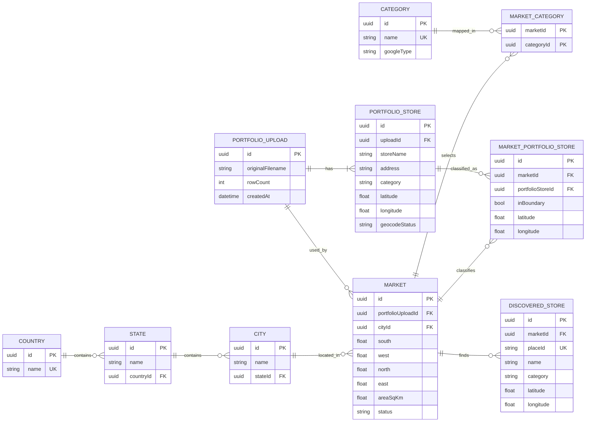

# MarketScope ER diagram

Preview this file in Cursor (Mermaid) or [mermaid.live](https://mermaid.live).

## How to explain it

- **COUNTRY / STATE / CITY** — location hierarchy with FKs; cascade dropdowns follow these relations.
- **CATEGORY** — seed labels + `googleType` for Places.
- **PORTFOLIO_UPLOAD / PORTFOLIO_STORE** — Step 1; lat/lng nullable.
- **MARKET** — Step 2 box (`south/west/north/east`, `areaSqKm` ≤ 30).
- **MARKET_PORTFOLIO_STORE.inBoundary** — uploaded pins inside vs outside the box.
- **DISCOVERED_STORE** — Google Places pins inside the box only.
