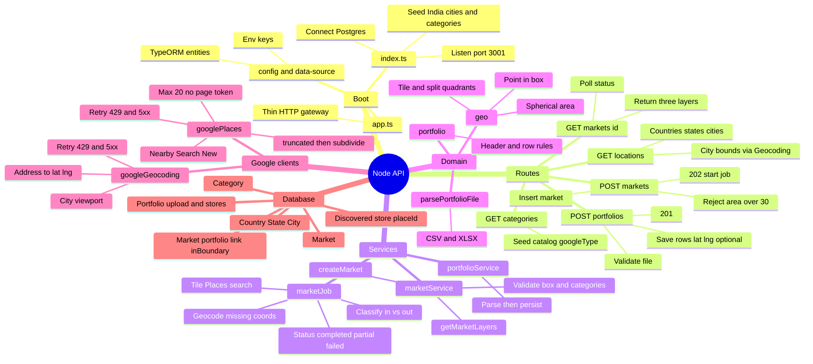

# Node mind map

Preview in Cursor (Mermaid) or [mermaid.live](https://mermaid.live).

One Express process plus Postgres. No Redis, no extra worker. Google lives only in `clients/`.

```mermaid
mindmap
  root((Node API))
    Boot
      index.ts
        Connect Postgres
        Seed India cities and categories
        Listen port 3001
      app.ts
        Thin HTTP gateway
      config and data-source
        Env keys
        TypeORM entities
    Routes
      POST portfolios
        Validate file
        Save rows lat lng optional
        201
      GET locations
        Countries states cities
        City bounds via Geocoding
      GET categories
        Seed catalog googleType
      POST markets
        Reject area over 30
        Insert market
        202 start job
      GET markets id
        Poll status
        Return three layers
    Services
      portfolioService
        Parse then persist
      marketService
        Validate box and categories
        createMarket
        getMarketLayers
      marketJob
        Geocode missing coords
        Classify in vs out
        Tile Places search
        Status completed partial failed
    Domain
      parsePortfolioFile
        CSV and XLSX
      portfolio
        Header and row rules
      geo
        Spherical area
        Point in box
        Tile and split quadrants
    Google clients
      googleGeocoding
        City viewport
        Address to lat lng
        Retry 429 and 5xx
      googlePlaces
        Nearby Search New
        Max 20 no page token
        truncated then subdivide
        Retry 429 and 5xx
    Database
      Country State City
      Category
      Portfolio upload and stores
      Market
      Market portfolio link inBoundary
      Discovered store placeId
```
