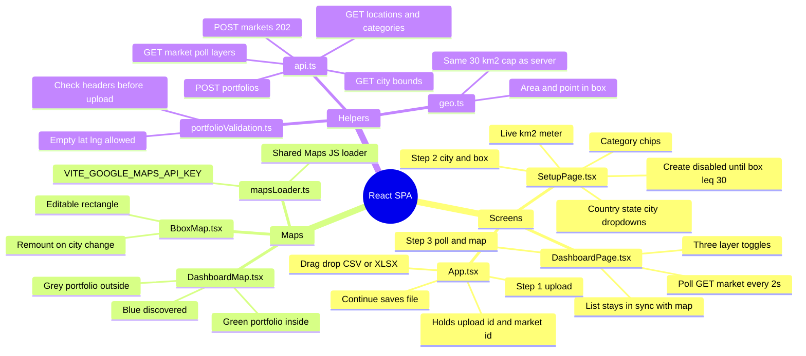

# React mind map

Preview in Cursor (Mermaid) or [mermaid.live](https://mermaid.live).

Vite app on port 5173. `/api` is proxied to Express. Maps JavaScript runs in the browser only.

```mermaid
mindmap
  root((React SPA))
    Screens
      App.tsx
        Step 1 upload
        Drag drop CSV or XLSX
        Continue saves file
        Holds upload id and market id
      SetupPage.tsx
        Step 2 city and box
        Country state city dropdowns
        Category chips
        Live km2 meter
        Create disabled until box leq 30
      DashboardPage.tsx
        Step 3 poll and map
        Poll GET market every 2s
        Three layer toggles
        List stays in sync with map
    Maps
      BboxMap.tsx
        Editable rectangle
        Remount on city change
      DashboardMap.tsx
        Blue discovered
        Green portfolio inside
        Grey portfolio outside
      mapsLoader.ts
        Shared Maps JS loader
        VITE_GOOGLE_MAPS_API_KEY
    Helpers
      api.ts
        POST portfolios
        GET locations and categories
        GET city bounds
        POST markets 202
        GET market poll layers
      portfolioValidation.ts
        Check headers before upload
        Empty lat lng allowed
      geo.ts
        Same 30 km2 cap as server
        Area and point in box
```
