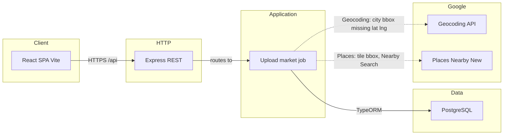

# MarketScope system design

Preview diagrams in Cursor (Mermaid) or [mermaid.live](https://mermaid.live).

This is a **single Node process** plus Postgres and Google. No Redis, no extra workers. The split below is **layers**, not three deployables.

## Architecture



The browser also loads **Maps JavaScript** (`VITE_GOOGLE_MAPS_API_KEY`) to draw the map and rectangle. That is not an API call through Express.

## Request vs job

```text
Browser
  POST /api/portfolios     -> validate CSV/XLSX -> portfolio_uploads + portfolio_stores -> 201
  GET  /api/locations/...  -> seed countries/states/cities
  GET  /api/locations/cities/:id/bounds -> Geocoding viewport (often > 30 km2)
  POST /api/markets        -> reject if area > 30 -> insert markets -> 202
  GET  /api/markets/:id    -> poll status + three layers

In-process job (same Node, not a queue):
  geocoding  -> fill portfolio_stores lat/lng
  classify   -> market_portfolio_stores.inBoundary
  discovering -> tile rectangle, Nearby Search, dedupe placeId, drop outside box
             -> discovered_stores
  status     -> completed | partial | failed
```

## Why this shape (interview)

- **Express is thin.** Validation, area cap, and Google live in services/clients so they can be tested without HTTP.
- **Job is async.** Places tiling can take tens of seconds. `202` + poll is the integration story. Swap later for Bull/SQS without changing the tables.
- **Google is behind clients.** Retries, 429 backoff. Nearby (New) has no page token — we tile and subdivide instead. Partial failure is a first-class status.
- **Postgres only.** Four bbox floats, no PostGIS. Cost cap is `areaSqKm <= 30` on the server, not only the UI.

## What talks to Google

| Caller | API | Writes |
|---|---|---|
| React | Maps JavaScript | nothing |
| API / job | Geocoding | `portfolio_stores` coords; default city viewport then user box on `markets` |
| Job | Places Nearby | `discovered_stores` only |

## Out of v1

Auth, Redis, PostGIS, Nominatim/Overpass, 150 m matching, multi-market UI.
